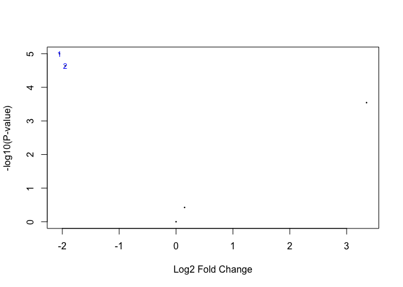

> Ritchie, ME, Phipson, B, Wu, D, Hu, Y, Law, CW, Shi, W, and Smyth, GK
> (2015). [limma powers differential expression analyses for
> RNA-sequencing and microarray
> studies](https://www.ncbi.nlm.nih.gov/pubmed/25605792).Nucleic Acids
> Research 43(7), e47.

[limma](https://bioconductor.org/packages/release/bioc/html/limma.html)
is an R package hosted on Bioconductor which finds differentially
expressed genes for RNA-seq or microarray. Recently I’ve been working on
a PCR-based low-density array and noticed that I forgot how to use limma
for the one hundredth time, so I decided to make a note.

Preparation
-----------

-   Log-transformed expression data in a matrix:  
    Each column represents an experiement, and each row represents a
    detected gene/probe.
-   Design matrix:  
    Each column represents a status of your data (e.g., wild-type,
    mutant, rescued…), and each row corresponds to an experiment in the
    expression matrix. This could be generated from an
    `expressionDataset` object, or we could create this manually if you
    only have a raw expression dataset like me.
-   Contrast matrix: Specified a set of parameters to specify the
    contrasts being compared later.

<!-- -->

    library(limma)

    # Create a dummy expression matrix
    exp_matrix <- data.frame(sample_1 = c(3, 3, 2, 2, 1), 
                             sample_2 = c(3.2, 2.8, 2, 2, 1.3), 
                             sample_3 = c(1, 1, 2, 2.3, 5), 
                             sample_4 = c(1.1, 0.9, 2, 2, 4), 
                             sample_5 = c(2.5, 2.5, 2, 2.5, 2), 
                             sample_6 = c(2.6, 2.3, 2.1, 2.2, 1.8), 
                             row.names = paste("gene", seq(5), sep = "_"), 
                             stringsAsFactors = FALSE)
    print(exp_matrix)

    ##        sample_1 sample_2 sample_3 sample_4 sample_5 sample_6
    ## gene_1        3      3.2      1.0      1.1      2.5      2.6
    ## gene_2        3      2.8      1.0      0.9      2.5      2.3
    ## gene_3        2      2.0      2.0      2.0      2.0      2.1
    ## gene_4        2      2.0      2.3      2.0      2.5      2.2
    ## gene_5        1      1.3      5.0      4.0      2.0      1.8

    # Create a design matrix
    design <- model.matrix(~ 0+factor(c(1,1,2,2,3,3)))
    colnames(design) <- c("Wild_type", "Mutant", "Rescue")

    print(design)

    ##   Wild_type Mutant Rescue
    ## 1         1      0      0
    ## 2         1      0      0
    ## 3         0      1      0
    ## 4         0      1      0
    ## 5         0      0      1
    ## 6         0      0      1
    ## attr(,"assign")
    ## [1] 1 1 1
    ## attr(,"contrasts")
    ## attr(,"contrasts")$`factor(c(1, 1, 2, 2, 3, 3))`
    ## [1] "contr.treatment"

    # Create a design matrix to indicate the comparisons to make by limma
    cont_matrix <- makeContrasts(MutvsWT = Mutant-Wild_type, 
                                 MutvsRes = Mutant-Rescue, 
                                 levels=design)

    print(cont_matrix)

    ##            Contrasts
    ## Levels      MutvsWT MutvsRes
    ##   Wild_type      -1        0
    ##   Mutant          1        1
    ##   Rescue          0       -1

Analysis
--------

Now, I am pretty much ready (except for the need to understand the
math).

    # Fit the expression matrix to a linear model
    fit <- lmFit(exp_matrix, design)

    # Compute contrast
    fit_contrast <- contrasts.fit(fit, cont_matrix)

    # Bayes statistics of differential expression
    # *There are several options to tweak!*
    fit_contrast <- eBayes(fit_contrast)

    # Generate a vocalno plot to visualize differential expression
    # Highlighting the top 2 genes
    volcanoplot(fit_contrast, highlight = 2)

    # Generate a list of top 100 differentially expressed genes
    top_genes <- topTable(fit_contrast, number = 100, adjust = "BH")
    print(top_genes)

    ##        MutvsWT MutvsRes  AveExpr           F      P.Value    adj.P.Val
    ## gene_1   -2.05    -1.50 2.233333 205.9703070 2.448629e-05 0.0001224315
    ## gene_2   -1.95    -1.45 2.083333 145.5778494 5.515948e-05 0.0001378987
    ## gene_5    3.35     2.60 2.516667  49.9796088 6.486868e-04 0.0010811446
    ## gene_4    0.15    -0.20 2.166667   2.6155372 1.715306e-01 0.2144132510
    ## gene_3    0.00    -0.05 2.016667   0.2942966 7.577324e-01 0.7577323813

    # Summary of results (number of differentially expressed genes)
    result <- decideTests(fit_contrast)
    summary(result)

    ##        MutvsWT MutvsRes
    ## Down         2        2
    ## NotSig       2        2
    ## Up           1        1
