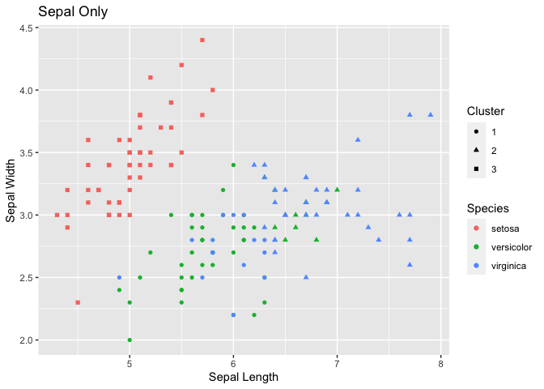
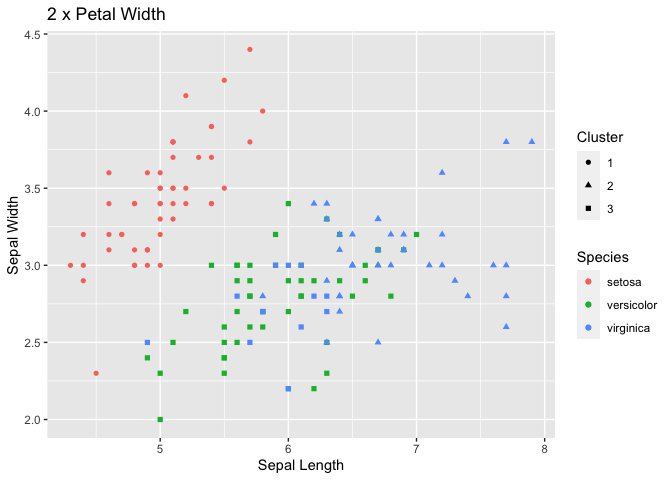
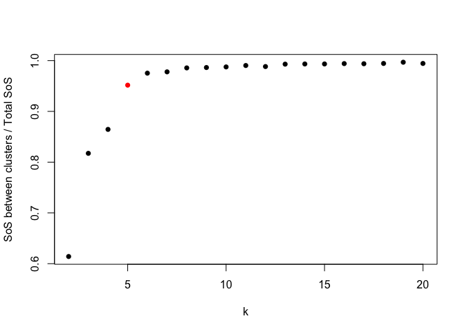
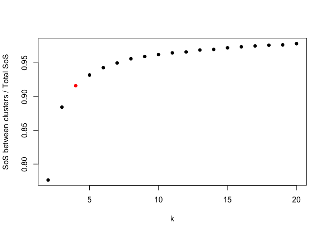
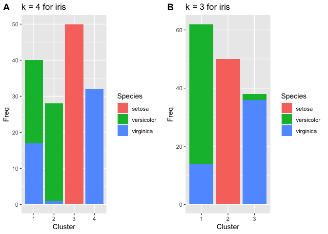

As a novice in genomic data analysis, one of my goal is to benchmark how
well a clustering method works. I ran across [this practice of doing
k-means at R-exercises](https://www.r-exercises.com/2018/04/13/11256/)
the other day and felt it might be a nice start because k-means is easy
to perform and conceptually simple for me to correlate what is happening
behind the clustering machinery.

It starts with manipulating the built-in `iris` dataset as usual. (I
would load `ggplot2` and `cowplot` first.) Now, let’s have some k-means
done.

    library(ggplot2)
    library(dplyr)

    ## 
    ## Attaching package: 'dplyr'

    ## The following objects are masked from 'package:stats':
    ## 
    ##     filter, lag

    ## The following objects are masked from 'package:base':
    ## 
    ##     intersect, setdiff, setequal, union

    library(cowplot)

    ## 
    ## ********************************************************

    ## Note: As of version 1.0.0, cowplot does not change the

    ##   default ggplot2 theme anymore. To recover the previous

    ##   behavior, execute:
    ##   theme_set(theme_cowplot())

    ## ********************************************************

    # Set random seed = 1
    set.seed(1)

    # Do k-means with 3 centers
    iris_k <- kmeans(iris[, c(1,2)], 3)

    # Append cluster identity
    iris_df <- iris
    iris_df$cluster <- iris_k$cluster

    # Append cluster identity
    iris_df <- iris
    iris_df$cluster <- factor(iris_k$cluster)
    species <- iris_df$Species
    sepal_only <- iris_df$cluster

    # Check species proportion in each cluster
    print(table(species, sepal_only))

    ##             sepal_only
    ## species       1  2  3
    ##   setosa      0  0 50
    ##   versicolor 38 12  0
    ##   virginica  15 35  0

    ggplot(iris_df, aes(x = Sepal.Length, y = Sepal.Width, 
                        color = Species, pch = cluster)) +
      geom_point() +
      labs(x = "Sepal Length", y = "Sepal Width", pch = "Cluster") +
      ggtitle("Sepal Only")

The cluster identities do not correspond well with species identity, and
the result does not look so impressive. It is imaginable because the
different species intermingle on the sepal dimensions, and `kmeans()`
considering sepal dimensions only would have a hard time in telling them
apart.

    # Include petal info into k-means
    iris_k2 <- kmeans(iris[, c(1:4)], 3)
    iris_df$cluster_sp <- factor(iris_k2$cluster)
    s_and_p <- iris_df$cluster_sp

    # Check the proportion of species of each cluster
    print(table(species, s_and_p))

    ##             s_and_p
    ## species       1  2  3
    ##   setosa     50  0  0
    ##   versicolor  0  2 48
    ##   virginica   0 36 14

    ggplot(iris_df, aes(x = Sepal.Length, y = Sepal.Width, 
                        color = Species, pch = cluster_sp)) +
      geom_point() +
      labs(x = "Sepal Length", y = "Sepal Width", pch = "Cluster") +
      ggtitle("Sepal and Petal")

After taking petal length and width, the clustering identities agreed
more with the “real” species identities.

Effect of linear transformation: What would happen if we multiply `Petal.Width` by 2?
-------------------------------------------------------------------------------------

    # Multiply Petal.width by 2 and do k-means again
    iris_df$Petal.Width <- iris_df$Petal.Width * 2
    iris_k_2pw <- kmeans(iris_df[, c(1:4)], 3)
    iris_df$cluster_pw2 <- factor(iris_k_2pw$cluster)
    doubled <- iris_df$cluster_pw2

    # Estimate how much cluster identity agrees with each other before
    # and after doubling petal width
    print(table(s_and_p, doubled))

    ##        doubled
    ## s_and_p  1  2  3
    ##       1 50  0  0
    ##       2  0 36  2
    ##       3  0  2 60

    ggplot(iris_df, aes(x = Sepal.Length, y = Sepal.Width, 
                        color = Species, pch = cluster_pw2)) +
      geom_point() +
      labs(x = "Sepal Length", y = "Sepal Width", pch = "Cluster") +
      ggtitle("2 x Petal Width")

Though the clustering result did not change too much, linear
transformation indeed altered the clustering identity. I was not
expecting that at first, but then *I realized k-means takes only
distance into consideration, and linear transformation on one dimension
does change relative distance.* So, while transforming one dimension
would influence clustering result, multiplying everything at the same
time should not change cluster identity.

    # Multiply everything by 2 and do k-means again
    iris_df2 <- iris_df * 2

    ## Warning in Ops.factor(left, right): '*' not meaningful for factors

    ## Warning in Ops.factor(left, right): '*' not meaningful for factors

    ## Warning in Ops.factor(left, right): '*' not meaningful for factors

    ## Warning in Ops.factor(left, right): '*' not meaningful for factors

    iris_k_db <- kmeans(iris_df2[, c(1:4)], 3)

    all_doubled <- iris_k_2pw$cluster

    # Estimate how much cluster identity agrees with each other before
    # and after doubling petal width
    print(table(all_doubled, doubled))

    ##            doubled
    ## all_doubled  1  2  3
    ##           1 50  0  0
    ##           2  0 38  0
    ##           3  0  0 62

And that’s definitely the case.

Scaling data
------------

One way to think of it might be that k-means considers Euclidean
distance, and if we expand or shrink one dimension, the influence of
that dimension on distance would change accordingly. To mitigate this
asymmetry of influence, scaling might be a good way if we assume every
dimension should have equal impact in clustering.

    # Doing z-transformation with scale()
    iris_df[, c(1:4)] <- scale(iris_df[, c(1:4)])
    iris_k_z <- kmeans(iris_df[, c(1:4)], 3)

    iris_df$cluster_kz <- iris_k_z$cluster
    z_trans <- iris_df$cluster_kz

    # Doing z-transformation with scale() of the original iris
    iris_ori <- scale(iris[, c(1:4)])
    iris_k_zo <- kmeans(iris_ori[, c(1:4)], 3)
    z_before_dbl <- iris_k_zo$cluster

    # Before and after doubling with z-transformation
    print(table(z_before_dbl, z_trans))

    ##             z_trans
    ## z_before_dbl  1  2  3
    ##            1 50  0  0
    ##            2  0  0 47
    ##            3  0 53  0

Scaling do a good job to give us consistent result regardless of whether
there is linear transformation. It is thus advisable to scale the data
in some way to make sure we could capture the diversity fairly and would
not let the dimension largest in number dominate the whole clustering.

Yet another dataset
-------------------

Now, we move on to another dataset from
[Kaggle.com](https://www.kaggle.com/c/titanic/data). The author of this
exercise suggested us to cluster passengers according to *sex, number of
sibling or spouse on board (SibSp), number of children or parents on
board (Parch), and ticket fare (fare)*, and see if the cluster could
predict survival.

    # Playing with training dataset from Titanic@Kaggle
    csvurl <- "./train.csv"

    train <- read.csv(csvurl, stringsAsFactors = F)
    print(head(train))

    ##   PassengerId Survived Pclass
    ## 1           1        0      3
    ## 2           2        1      1
    ## 3           3        1      3
    ## 4           4        1      1
    ## 5           5        0      3
    ## 6           6        0      3
    ##                                                  Name    Sex Age SibSp Parch
    ## 1                             Braund, Mr. Owen Harris   male  22     1     0
    ## 2 Cumings, Mrs. John Bradley (Florence Briggs Thayer) female  38     1     0
    ## 3                              Heikkinen, Miss. Laina female  26     0     0
    ## 4        Futrelle, Mrs. Jacques Heath (Lily May Peel) female  35     1     0
    ## 5                            Allen, Mr. William Henry   male  35     0     0
    ## 6                                    Moran, Mr. James   male  NA     0     0
    ##             Ticket    Fare Cabin Embarked
    ## 1        A/5 21171  7.2500              S
    ## 2         PC 17599 71.2833   C85        C
    ## 3 STON/O2. 3101282  7.9250              S
    ## 4           113803 53.1000  C123        S
    ## 5           373450  8.0500              S
    ## 6           330877  8.4583              Q

    # Make Sex and Pclass dummy variable
    train$Sex <- factor(train$Sex, levels = c("female", "male"),
                        labels = c("0", "1"))
    train$Pclass <- ifelse(train$Pclass == "3", 1, 0)

    # K-means (k = 4) according to Sex, SibSp, Parch, Fare
    tita_k <- kmeans(select(train, Sex, SibSp, Parch, Fare), centers = 4, nstart = 20)
    train$cluster_1 <- tita_k$cluster

    # Survival of each cluster
    print(
      table(train$Survived, train$cluster_1)[2, ]/colSums(table(train$Survived, train$cluster_1))
      )

    ##         1         2         3         4 
    ## 0.4703390 0.6770833 0.2820037 0.7000000

It does look like the rate of survival differs between groups. To
evaluate how big k should be to capture the most information from the
dataset, variance explained could be calculated here. It was actually
super-easy because `kmeans()` already prepared us *the sum of squares
between clusters* (betweenss) and *total sum of squares* (totss) in its
output.

    # Trying different k (2 - 20)
    ## Initiate a list to store the results
    tita_km <- list()

    for (i in c(2:20)) {
      index <- i - 1
      tita_km[[index]] <- kmeans(select(train, Sex, SibSp, Parch, Fare), centers = i, nstart = 20)
    }

    # Calculate variance explained by cluster
    ve <- sapply(tita_km, function(x) x[["betweenss"]]/x[["totss"]])
    plot(ve ~ c(2:20), xlab = "k",
         ylab = "SoS between clusters / Total SoS",
         col = c(rep("black",3), "red", rep("black",15)), pch = 16)

With visualization, it seems the margin drops when k &gt; 5, and thus
[the elbow
method](https://en.wikipedia.org/wiki/Elbow_method_%28clustering%29)
would suggest k = 5 as the optimal cluster number.

    train$cluster_5 <- tita_km[[5]][["cluster"]]
    print(
      table(train$Survived, train$cluster_5)[2, ] /colSums(table(train$Survived, train$cluster_5))
    )

    ##         1         2         3         4         5         6 
    ## 0.6470588 0.2702170 0.7575758 0.6486486 1.0000000 0.4272727

This time, the difference of survival between clusters becomes even
sharper. Does more variance explained necessarily lead to better
correlation with outcome of interest? To test this notion, I went back
to do the same thing for the iris dataset.

    # Testing different k in iris

    iris_km <- list()

    for (i in c(2:20)) {
      index <- i - 1
      iris_km[[index]] <- kmeans(select(iris, -Species), centers = i, nstart = 20)
    }

    # Calculate variance explained
    ve_iris <- sapply(iris_km, function(x) x[["betweenss"]]/x[["totss"]])
    plot(ve_iris ~ c(2:20), xlab = "k",
         ylab = "SoS between clusters / Total SoS",
         col = c(rep("black",2), "red", rep("black",16)), pch = 16)

It seems that the “elbow” is on k = 4.

    # k = 4
    iris$clus4 <- iris_km[[3]][["cluster"]]
    k4 <- as.data.frame(table(iris$Species, iris$clus4))

    k4p <- ggplot(k4, aes(x = Var2, y = Freq, fill = Var1)) +
      geom_bar(stat = "identity") +
      labs(x = "Cluster", fill = "Species") +
      ggtitle("k = 4 for iris")

    # k = 3
    iris$clus3 <- iris_km[[2]][["cluster"]]
    k3 <- as.data.frame(table(iris$Species, iris$clus3))

    k3p <- ggplot(k3, aes(x = Var2, y = Freq, fill = Var1)) +
      geom_bar(stat = "identity") +
      labs(x = "Cluster", fill = "Species") +
      ggtitle("k = 3 for iris")

    print(plot_grid(k4p, k3p, labels = "AUTO"))

It seems that versicolor and virginica are hard to tell apart based on
the information iris dataset provides, but k = 4 did a better job in
identifying a subset of versicolor apart from the mixed population. In
this case, k number indicated by elbow method seems to score again.

Take home message
-----------------

This exercise helped me learn the fundamental behaviors of k-means and
how R implemented it among other things. It was a pleasant surprise to
discover `scale()` , so I no longer have to reinvent the wheel. The
detailed results in addition to cluster identity `kmeans()` provides by
default not only make life easier and remind me of the things to look
after clustering.

1.  K-means sort of *summarizes* information of multiple dimension to
    categorize them.
2.  K-means is distance-based, so linear transformation would change the
    clustering result.
3.  To prevent the dimensions bigger in number dominate clustering,
    scaling is a recommended before k-means if we assume every dimension
    is equal in importance.
4.  Besides cluster identity, `kmeans()` also gives total sum of
    squares, sum of square between clusters, and in-cluster sum of
    squares, and many other information by default (check `?kmeans()`).
    This makes calculation of variance explained very intuitive.
5.  Elbow method is based on the marginal gain of variance explained
    with adding more and more cluster and could help us assess the
    preferable number of cluster.
