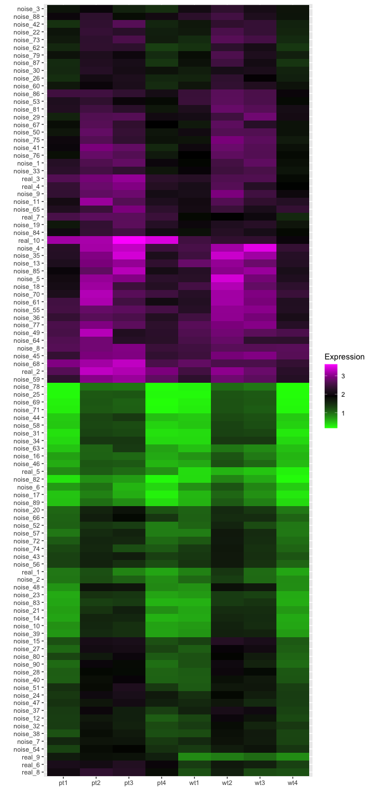
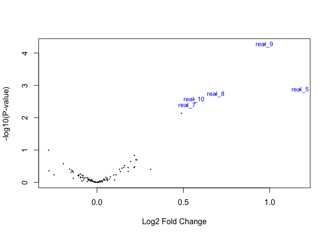
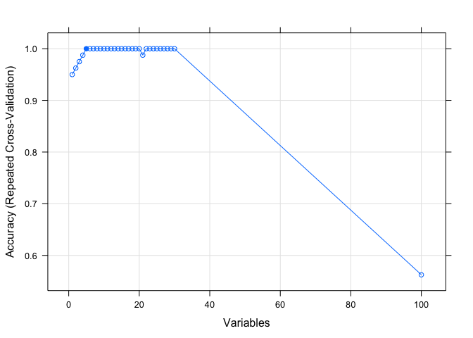

Oftentimes, the sample I deal with is full of noise or confounding
factors that I am not interested in. For example, human specimen is
doomed noisy because the race, age, sex, occupation, or the life story
of the subject would have influenced the results. Careful matching those
statistics and increasing sample number would help a lot minimize known
confounding factors and have a better chance to cancel other unknown
factors, but sometimes sample number is just beyond our control.

I become curious about *how well differential expression analysis works
* *on this kind of dataset* and *whether other techniques could help us*
*fish signal from noise*.

Thus, I decided to make a dataset, in which 10 out of 100 “genes” are
informative. In this dataset, there are 8 samples, with their disease
state being either 0 (healthy) or 1 (diseased); sex being either 0 or 1;
age being a number between 0–1, which represents age/100; and other
factors is represented by a random number between 0–1.

    library(ggplot2)
    library(cowplot)

    ## 
    ## ********************************************************

    ## Note: As of version 1.0.0, cowplot does not change the

    ##   default ggplot2 theme anymore. To recover the previous

    ##   behavior, execute:
    ##   theme_set(theme_cowplot())

    ## ********************************************************

    # Generating subject characteristics

    # Disease state
    disease <- c(0,0,0,0,1,1,1,1)

    # Sex
    set.seed(1629)
    sex <- as.numeric(runif(n = 8, min = 0, max = 1) > 0.5)

    # Hidden confounding factor for each N
    hcf <- runif(n = 8, min = 0, max = 1)

    # Age
    age <- round(runif(n = 8, min = 0, max = 1), digits = 2)

    # Meta data table
    meta_df <- data.frame(disease, sex, "hidden factor" = hcf, age, 
                          row.names = paste("object", seq(8)))

    print(meta_df)

    ##          disease sex hidden.factor  age
    ## object 1       0   0     0.1429998 0.64
    ## object 2       0   1     0.3183128 0.98
    ## object 3       0   1     0.1686106 0.57
    ## object 4       0   0     0.1923663 0.21
    ## object 5       1   0     0.1288493 0.53
    ## object 6       1   1     0.5198558 0.64
    ## object 7       1   1     0.9773168 0.09
    ## object 8       1   0     0.4264767 0.07

Basic assumption of the simulated subjects is described as:

[gene expression] = [disease] × A + [sex] × B + [age] × C + [other factors] × D + [noise]

Then, the expression of “genes” are calculated considering the age, sex,
other confounding factors combined, and technical variation represented
by a noise term that varies between 0–0.5.

In the equation above, *A* is 0.1 for gene \#1, 0.2 for gene \#2, and 1
for gene \#10. A is 0 for the rest of the 90 genes. *B, C,* and *D* are
randomly generated with the sum of *A, B, C,* and *D* restricted to &lt;
1. So, only the first 10 genes are relevant to disease state, and gene
\#10 is the most representative one.

With these meta data, we can generate a dummy expression matrix:

    # Generate dummy data set
    ## Saving the genes and the random generated coefficients in two lists
    feature <- list()
    coef <- list()

    ## Generating 100 genes
    for (i in seq(100)) {
      # Generate 10 genes that is related to disease
      if (i <= 10) {
        coef_sex <- runif(n = 1, min = 0, max = (1 - i/10))
        coef_hcf <- runif(n = 1, min = 0, max = (1 - i/10 - coef_sex))
        coef_age <- 1 - (i/10 + coef_sex + coef_hcf)
        noise <- runif(1, min = 0, max = 0.5)
        ident <- runif(1, min = 0, max = 2)
        basal <- rnorm(n = 8, sd = ident * 0.1, mean = ident)
        feature[[i]] <- disease * (i / 10) + sex * coef_sex + age * coef_age + hcf * coef_hcf + noise + basal
        coef[[i]] <- c(i/10, coef_sex, coef_age, coef_hcf, noise)
        next
      }
      # The rest 90 genes are not related to disease state
      coef_sex <- runif(n = 1, min = 0, max = 1)
      coef_hcf <- runif(n = 1, min = 0, max = (1 - coef_sex))
      coef_age <- 1 - (coef_sex + coef_hcf)
      noise <- runif(1, min = 0, max = 0.5)
      ident <- runif(1, min = 0, max = 2)
      basal <- rnorm(n = 8, sd = ident * 0.1, mean = ident)
      feature[[i]] <- sex * coef_sex + age * coef_age + hcf * coef_hcf + noise + basal
      coef[[i]] <- c(0, coef_sex, coef_age, coef_hcf, noise)
    }

    # Formatting the expression matrix
    expression <- do.call("rbind", feature)
    coefficient <- do.call("rbind", coef)
    colnames(expression) <- c("wt1", "wt2", "wt3", "wt4", "pt1", "pt2", "pt3", "pt4")
    colnames(coefficient) <- c("Disease", "Sex", "Age", "HCF", "Noise")
    expression <- data.frame(expression)

    expression$gene <- c(
    sapply(seq(10), function(x) paste("real", x, sep = "_")),
    sapply(seq(90), function(x) paste("noise", x, sep = "_")))

The script above generated something like this:

    # Transform the expression matrix for plotting
    expression_l <- tidyr::gather(expression, key = "Subject", 
                                  value = "Expression", -gene
    )

    # Order the genes by hierarchical clustering
    row.names(expression) <- expression$gene
    gene_dist <- dist(expression[ , names(expression) != "gene"])
    gene_hc <- hclust(gene_dist)

    expression_l$gene <- factor(expression_l$gene, 
                                levels = rev(gene_hc$labels[gene_hc$order]))

    ggplot(expression_l, aes(x = Subject, y = gene, fill = Expression)) +
      geom_tile() +
      scale_fill_gradientn(colours = c("green", "black", "magenta")) +
      labs(x = "", y = "")

From the heatmap, it seems that the *other factors* is contributing a
lot to the difference between samples. Is differential expression
analysis capable of finding the genes that are really related to
diseases?

    library(limma)

    log_exp <- log2(expression[, -9])
    log_exp$gene <- expression$gene

    design <- model.matrix(~ 0+factor(c(0,0,0,0,1,1,1,1)))
    colnames(design) <- c("Ctrl","Patient")
    fit <- lmFit(log_exp[, -9], design)
    fit$genes$ID <- log_exp$gene

    cont.matrix <- makeContrasts(PatientvsCtrl = Patient-Ctrl, levels=design)
    fit2 <- contrasts.fit(fit, cont.matrix)
    fit2 <- eBayes(fit2)
    volcanoplot(fit2, highlight = 5)

    tt <- topTable(fit2, number = 20, adjust = "BH")
    print(head(tt))

    ##              ID     logFC    AveExpr        t      P.Value   adj.P.Val
    ## real_9   real_9 0.9692060  0.2966555 7.263496 5.343801e-05 0.005343801
    ## real_5   real_5 1.1761718 -0.7116106 4.611329 1.348025e-03 0.061848855
    ## real_8   real_8 0.6875499  0.7299697 4.385535 1.855466e-03 0.061848855
    ## real_10 real_10 0.5617334  1.4676770 4.130614 2.685130e-03 0.067128249
    ## real_7   real_7 0.5213747  1.1164215 3.843007 4.119657e-03 0.082393143
    ## real_6   real_6 0.4883247  0.8115677 3.471073 7.284143e-03 0.121402376
    ##                 B
    ## real_9   2.338578
    ## real_5  -1.010201
    ## real_8  -1.342311
    ## real_10 -1.725818
    ## real_7  -2.168663
    ## real_6  -2.755183

It turned out `limma` did a great job. It hit 3 significantly
up-regulated genes (real\_10, real\_9, and real\_8), and from the
volcano plot, we could see the disease correlated genes (annotated as
“real\_*x*”) are quite visible even if they were not significant.

Does fancier tools do a better job in finding real differentially
expressed genes in a noisy dataset? I tried `caret` and `Boruta` to give
machine learning a try.

    # Reverse feature selection with caret
    library(caret)
    exp_rfe <- t(expression[, -9])
    colnames(exp_rfe) <- expression$gene
    ctrl <- rfeControl(functions = rfFuncs,
                       method = "repeatedCV",
                       repeats = 10, verbose = FALSE)
    type_exp <- factor(c(0,0,0,0,1,1,1,1), labels = c("0", "1"))
    lmProfile_exp <- rfe(x=exp_rfe, y=type_exp,
                         sizes = c(1:30),
                         rfeControl = ctrl)
    plot(lmProfile_exp, type = c("g", "o"))

    predictors(lmProfile_exp)

    ## [1] "real_9"  "real_6"  "real_7"  "real_10" "real_5"

Reverse feature selection with `caret` gave me 4 genes (real\_7–10),
while `Boruta` rejected every single gene. It seemed that at least for
this dataset, traditional differential expression performed at least as
well as machine learning approaches.

Increase the noise term
-----------------------

Interestingly, when I gave noise term a coefficient of 10 instead of 1.
`limma` identified more up-regulated genes (real\_6–10), while the
results from `caret` and `Boruta` remained the same. It was against my
anticipation that the *real* difference would be buried in the noise, so
I tried to use a coefficient of 10000. This time `limma` found even more
up-regulated genes (real\_4–10)…

Lower the effect size of disease state
--------------------------------------

On the other hand, When I made disease term 10 times smaller, `limma`
could not find any significantly up-regulated gene, while `caret`
managed to find one (real\_9).

Increase sample number
----------------------

Finally, to see whether sample number could improve sensitivity when
disease term is small, I tried to do the same analysis on 80 subjects
(40 control and 40 diseased). I was expecting both differential
expression analysis and machine learning would benefit from a larger
sample number.

With 80 samples, `limma` still could not find any significantly changed
genes, `caret` found 5 (real\_4, 6, 7, 8, 9) along with 5 false
positive, and there was still no luck for `Boruta`.

In this short experiment, my impression is that:

1.  Effect size and consistency play the most important role in
    differential expression analysis. A small effect size gets
    overwhelmed by confounding factors and noise, while larger ones
    could be detected even with a large noise term.
2.  With a small sample size, result of reverse feature selection with
    `caret` and `limma` are not much different than each other.
3.  When effect size is small, increasing sample number helps a bit in
    `limma` (adjusted p value goes down with increased sample number).
    `caret` seems to benefit more from larger sample number (because
    it’s machine learning?), but even with more samples, false positive
    is quite concerning.

I guess the difficult choice between sensitivity and specificity would
still be an issue here. Though I hoped machine learning could work like
magical black box, it performed similar to traditional approaches. I
would need to learn more about the basics of machine learning before I
could tell if there is some better way doing this.
