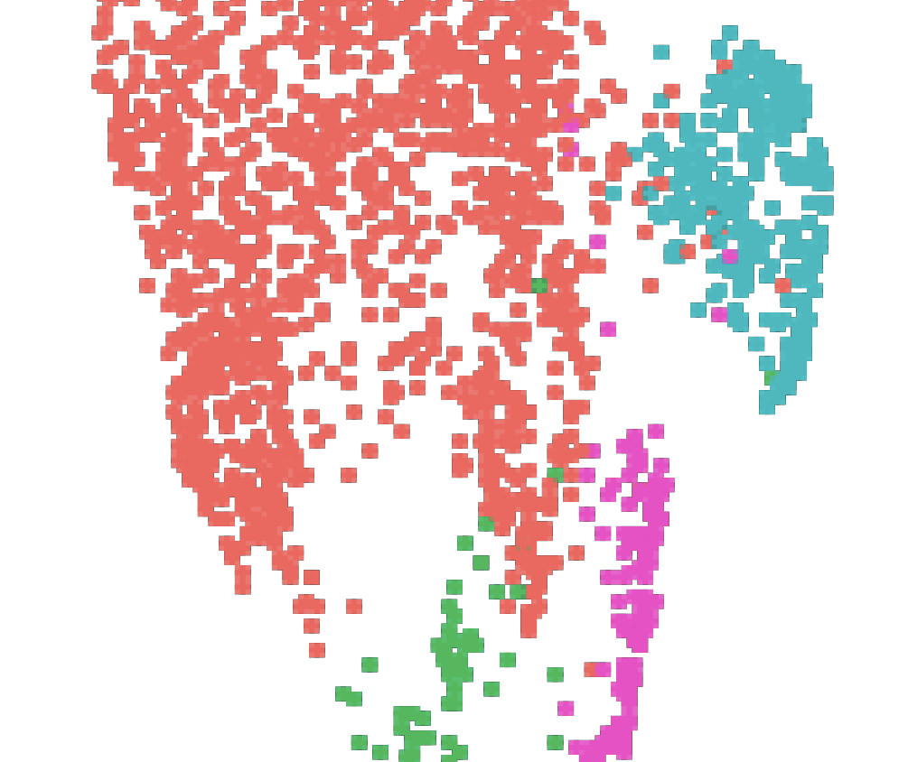
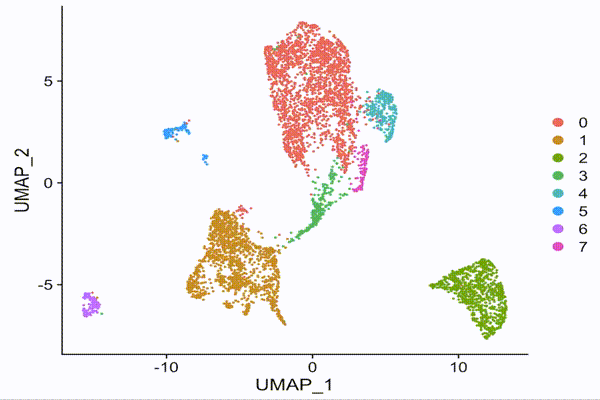
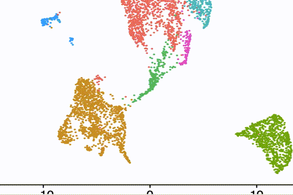

If you updated [Seurat](https://satijalab.org/seurat/) recently, you might find your `FeaturePlot()` and `DimPlot()` giving plots that look pixelated instead of the circular dots we are used to.

Don't panic, this is because in a recent update, `raster = TRUE` becomes default for `FeaturePlot()` and `DimPlot()` when your dataset contains more than 50,000 cells. Setting `raster = FALSE` will make the plots the way they were again.

## What is happening?

Under the hood, when `raster = TRUE`, `Seurat` uses [`scattermore`](https://cran.r-project.org/web/packages/scattermore/index.html) to _rasterize_ the plots. What `scattermore` does is to fit the dots in your plot into an image with 256*256 pixels, and this is why now your plots seem less like the work of [Georges Seurat](https://en.wikipedia.org/wiki/Georges_Seurat) but pixel arts in early [Nintendo Famicom](https://en.wikipedia.org/wiki/Nintendo_Entertainment_System) games.

## What is raster(ization)?

[Rasterization](https://en.wikipedia.org/wiki/Rasterisation) is a process of drawing objects with pixels.

What exactly is an object we are talking about? When `Seurat` plots, everything in the plots are objects. That is, every tile in your beautiful heatmap and every point in your UMAP are objects.

Rasterization (that happens when you set `raster = TRUE`) is the process of drawing these with a limited number of pixels.

## Why (not) raster?

### Why R saves image as objects when it can?

This might happen to you before: You are interested in a tiny spot of a confocal image in a paper, but when you zoom in, the figure becomes pixelated and blurry. As a result, you'll need to look if the publisher provides higher resolution version of the figure.

This is an example of resolution being a common issue for rasterized image (or bitmaps). Because you only have a limited number of pixels, when you zoom the image in, each pixel becomes only larger but the pixel is just a square with one color -- no more details can be found within the square with zooming.

Here is an example of a raster image. Note that while the dots look circular at first, when you zoom in close enough, you can see the pixels.

### How vector images overcome the zooming challenge?

Vector images (image with objects), on the other hand, are ideal for zooming. In a vector image, each object is described individually as "a blue circle" instead of as pixels. Rasterization happens only when you open the file and the image has to be drawn onto the screen (which consists of tiny shiny pixels). This allows vector images to be rasterized and drawn according to the magnification. When you zoom in, the image can be re-drawn according to the description to the object to provide more detail. As a result, when you magnify a vector image, it doesn't become blurry and pixelated.

Here's an example of a vector image. The dots look circular no matter how close you look. However, did you notice that the dots are blurry for a moment when I zoom in? That is re-drawing.

### Why you might not want everything to be vector images?

While vector images are great for zooming, because they are redrawn only when they are displayed, it requires your computer to do some computation. This is usually fine with modern computers that often more powerful than necessary, but it represents a unique challenge for single-cell data analysis.

If there's a hundred thousand cells in your data, there are a hundred thosand objects in a feature plot. It could be even worse for heatmaps, where each gene plotted for each cell makes a tile. A heatmap with a hundred genes for a hundred thousand cells results in a million objects.

This is why when we are working with large datasets, the plots take longer to open. This might also be why some paper, when you scroll down, the part of the figure containing a UMAP might be blank for seconds before it finally appears. In short, our computers make a tremendous effort to draw objects one by one, but oftentimes, we don't really need the UMAPs or feature plots to be look that well when zoomed in.

## `Seurat`'s take on this

To avoid long loading time and file size for plots with a larger cell number, the authors of `Seurat` decides to raster plots by default. This could save some time for exploratory analysis, and most of the time, when we read these plots, we are reading patterns, so how each dot look should not matter especially when the dataset contains a huge number of cells.

Saying so, I do wish rasterization could be performed with a higher resolution than 256*256, so the figures in some papers will not be that sluggish to load.

