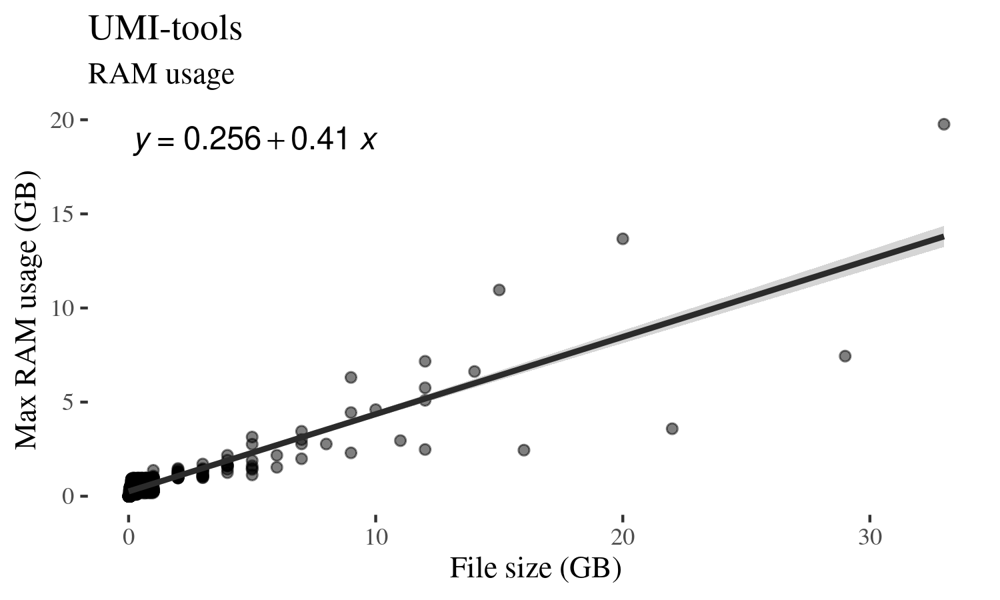
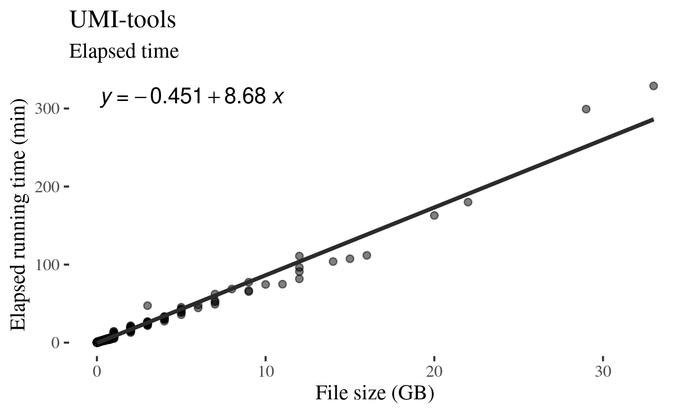

While having access to HPC, resource is not infinite, and our HPC reasonably 
manage job queues by how much computation you have requested recently. This 
provides incentive to only request enough for whatever task you work on, but 
for me, it hasn't been easy: Estimating resource usage is not trivial, and 
trying to be as frugal as possible would sometimes result in time-consuming 
jobs that are terminated after several hours or days due to insufficient 
memory or running time requested.

Therefore, try to keep an record of things that I do repetitively seems like a 
good idea.

# `umi-tools`

I have been mainly using it to de-duplicate reads from BAM files generated by 
`cellranger`, so the command that I use is usually like:

```
# De-duplication with umi_tools.
# Errors could happen due to resource limit and might need to adjust manually.
umi_tools dedup --extract-umi-method=tag \
	--umi-tag=UB \
	--cell-tag=CB \
	--stdin=${path_to_bam_to_dedup} \
	--log=${path_to_save_dedup_log} > ${path_to_save_deduped_bam}
```

As you can see from my comment, I encountered errors more than often so I had 
to remind myself. Recently, I finally took this seriously enough to examine
how resource usage scales.

# `umi_tools dedup` scales linearly with input file size

In short, both max RAM usage and running time scaled linearly with the size of 
the BAM file to de-duplicate.



You can see above that while there are variations, input file size and max RAM 
usage during run shows a linear relationship. The variation could reflect how 
many UMIs were mapped to the same genomic location as that would significantly 
change the complexity of UMI graph that `umi-tools` generates.



Similarly, the time it takes to de-duplicate a BAM file scales linearly with a 
much less variation than RAM usage.

Given the information, I am currently requesting a minimum memory of (1GB + 75% of 
input file size), which seems to serve me well so far.

As for computation time to request, I request 20 minutes per GB of input file 
plus a baseline of 30 minutes (e.g., for 2GB input, I request 70 minutes). This 
has usually been an overkill so it could be tune down further.

All jobs were run with one core as [`umi-tools` does not natively support 
multithreading yet](https://umi-tools.readthedocs.io/en/latest/faq.html). 
It should be possible to de-duplicate each 
chromosome manually if running the whole BAM proves to be intractable though.


