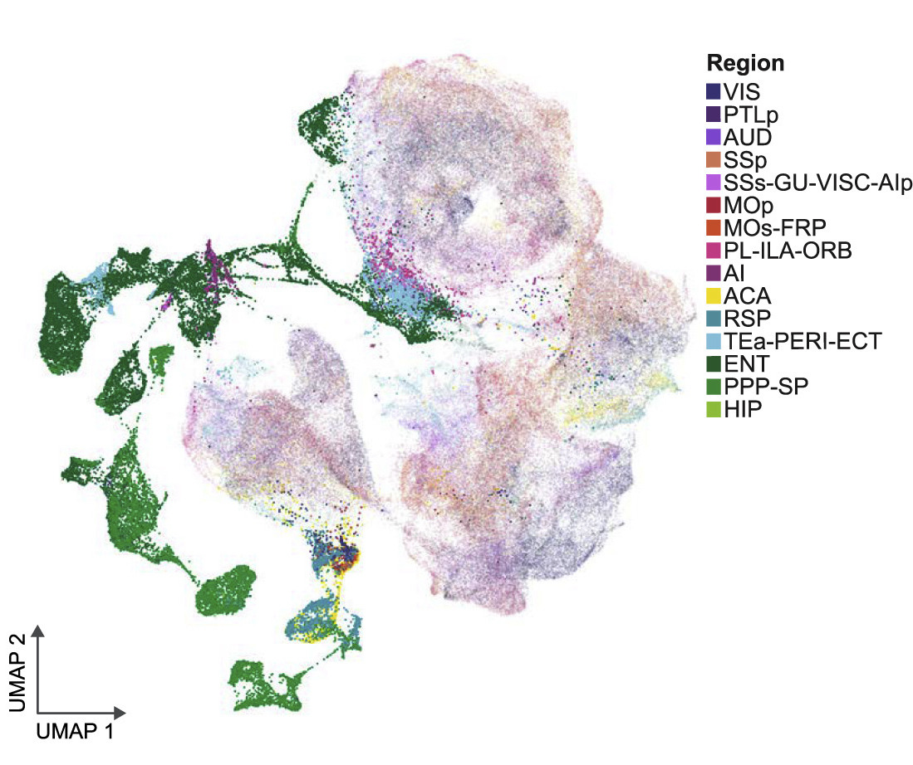
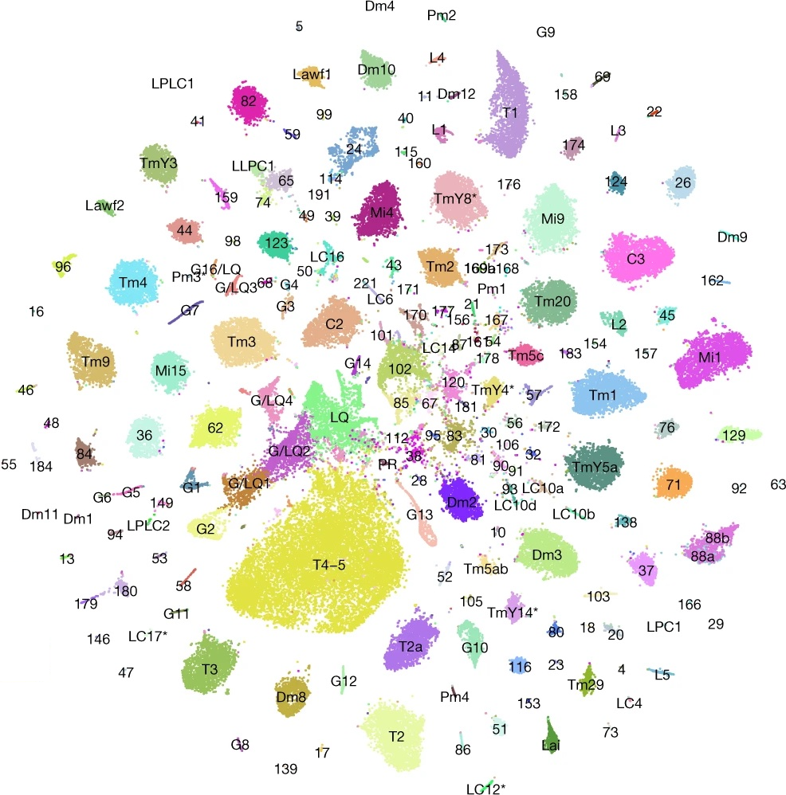

```{r include=FALSE}
library(qrcode)
library(ggplot2)
```


# About Me

.pull-left[
## Yen-Chung Chen

- 6th-year PhD student in the Desplan lab at NYU
- Work with 🪰, `r fontawesome::fa(name = "r-project")`, 
`r fontawesome::fa(name = "python")`, and C
- Learn more:
```{r echo=FALSE, out.width = "45%"}
plot(qr_code("https://www.yenchungchen.com/"), col = c("#faf4ed", "#286983"))
```

]

.pull-right[
```{r, echo=FALSE, out.width="75%"}

```
]

---
layout: true
# Genetic determinism and genomics

.left-column[]

.right-column[
  `r knitr::include_graphics("img/dna-4043148_1280.png")`
]

.footnote[
  Image by [Gordon Johnson](https://pixabay.com/users/gdj-1086657/?utm_source=link-attribution&utm_medium=referral&utm_campaign=image&utm_content=4043148) from Pixabay
]

---

- 1928 Griffith's experiment

--
- 1977: Sanger sequencing

--
- 1990: Human Genome Project Started

--
- 1995: First cDNA microarray 

--
- 2000: Short-read sequencing

--
- 2006: First RNA-Seq

--
- 2009: First manual scRNA-seq

--
- 2014: First commercial scRNA-seq

---
layout: false
# What's missing?

Sometimes, the goal just seems to be moving _really_ fast... but for good
reasons.

--
.midimg[
`r knitr::include_graphics("img/moving_goal.png")`
]

---
layout: true
# What might be _NOT_ missing?
.lgimg[
.left-column[
```{r echo=FALSE}

```
]
]
.footnote[
[Allen Brain Atlas / Yao _et al._ (2022)](https://doi.org/10.1016/j.cell.2021.04.021)
]

---
.right-column[
How many cell types are there?
]

---

.right-column[
How many cell types are there?
## 43
]

---
layout: true
# What might be _NOT_ missing?
.left-column[
.lgimg[
```{r echo=FALSE}

```
]
]
.footnote[
[Özel and Simon _et al._ (2021)](https://doi.org/10.1038/s41586-020-2879-3)
]

---
.right-column[
How many cell types are there?
]

---

.right-column[
How many cell types are there?
## 248
]

---
layout: false
# All's good in scRNAseq-opia?

--
.left-column[
`r knitr::include_graphics("img/humans-and-flies-employ-very-similar-mechanisms-for-brain-development-and-function-cropped-780x440.x9cfab47e.webp")`
]
.footnote[
Image credit: [Kings College London](https://www.kcl.ac.uk/news/humans-and-flies-employ-very-similar-mechanisms-for-brain-development-and-function)
]

--
.right-column[

- Fly optic lobe:
    80,000

- Mouse cortex:
    5,000,000
]

---
# What is happening?

- **60** times more cells with **less than 20%** diversity - How does this
makes sense?

--

.center[
## Maybe they were just under clustering?
]

--
.midimg[
```{r echo=FALSE}
  knitr::include_graphics("img/yes_but_actually_no.jpeg")
```
]

---
# How many clusters should you have?

- Premises: Prior knowledge about abundance & sufficient sample size

--
.footnote[
[Stability Testing (Jean Fan)](https://jef.works/blog/2018/02/28/stability-testing/), 
[Actionable scRNA-seq clusters (Valentine Svensson)](https://www.nxn.se/valent/2018/3/5/actionable-scrna-seq-clusters)
]

- What do _you_ want from a "cell type"?

--
  - _What are the markers for each subpopulation? How can I FACS for it?_
  
--
  - _What are the differentially expressed genes marking each of our identified
  transcriptional subpopulations?_
  
--

### One should cluster only up to the point when you have _actionable_ clusters

---
# What exactly is _actionalble_ for _you_?

- Actionable markers are those:

  1. Specifically mark the cluster of interest, and
  
--
  2. Distinguishable with your handy tools (e.g., FACS, IHC, (F)ISH...)
  
--

## Basically, only those you can do experiment to prove a point about a cluster are actionable.
  
---
# Universal scarcity of an actionable marker

- Yao _et al._ (Allen Brain Atlas) had 388 clusters, but only 43 are actionable.

--

- Özel and Simon _et al._ had 248 clusters, but only 86 are actionable.

--

## Despite the 7,000+ tiling regulartory element reporters in the fly community...

---
# Two markers are better than one, right?

.footnote[
[Shekhar _et al_. (2016)](https://doi.org/10.1016/j.cell.2016.07.054)
]

.pull-left[
.midimg[`r knitr::include_graphics("img/shekhar_whole_tsne.png")`]
]

--

.pull-right[
`r knitr::include_graphics("img/shekhar_umap.jpg")`
]

--

Sometimes, you look at a cluster and notice another marker provides extra 
information. Like _Cpne9_ splits cluster #15 here.

---
# Two markers are better than one, right?

.footnote[
[Shekhar _et al_. (2016)](https://doi.org/10.1016/j.cell.2016.07.054)
]

`r knitr::include_graphics("img/shekhar_stain.png")`

--

And you examine the co-expression _in vivo_.

---
class: section-title
# How has your experience been?

---
# Using multiple markers are non-trivial

- Identification of synergistic markers is rare and serentipitous most of
the time.

--

- I personally had little nice experiences with using _top_ markers together,
but of course your milleage may vary.

--

## Why it is hard to find combinations that fit our needs?

---
layout: true
# Differential expressed genes $\supset$ markers

.pull-left[
### Cluster of interest
.midimg[`r knitr::include_graphics("img/tmy14.png")`]
]

---

.pull-right[
| Gene | Adj p| log2FC | 
|:---:|:---:|---:|
|CG2022|0|0.86|
|CG12163|0|1.98|
|CG3940|0|2.85|
|Invadolysin|0|1.18|

.center[
.<br/>
.<br/>
.<br/>
]

]
---
.pull-right[
### CG2022
.midimg[`r knitr::include_graphics("img/CG2022.png")`]
]

--

### DEGs could be too sparse to use as a marker.

---

.pull-right[
### CG12163
.midimg[`r knitr::include_graphics("img/CG12163.png")`]
]

--

### Fold change could be misleading (or not actionable).

---
layout: false
# Marker synergization is a beast of its own

.pull-left[
### CG12163
.midimg[`r knitr::include_graphics("img/CG12163.png")`]
]

--

.pull-right[
###CG3940
.midimg[`r knitr::include_graphics("img/CG3940.png")`]
]

--

### If we take the top two markers, are they going to intersect _usefully_?

---
layout: true
# Top markers might not make the best team

.pull-left[
### Cluster of interest
.midimg[`r knitr::include_graphics("img/tmy14.png")`]
]

---
--

.pull-right[
### CG12163 $\cap$ CG3940
.midimg[`r knitr::include_graphics("img/CG12163xCG3940.png")`]
]

---
.pull-right[
### CG12163 $\cap$ CG3940
.midimg[`r knitr::include_graphics("img/CG12163xCG3940_anno.png")`]
]

--

### They worked better than they were individually, but some cells outside the cluster are labeled and impossible to tell _in vivo_.

---
layout: false
# Poor markers could surprise with syngergy

.pull-left[
### Tj
.midimg[`r knitr::include_graphics("img/tj.png")`]
]

--

.pull-right[
### Kn
.midimg[`r knitr::include_graphics("img/kn.png")`]
]
--

### Individually, Tj and Kn did not make it even to the top 10 markers ranked by adjusted p values.

---
# Poor markers could surprise with syngergy

.pull-left[
### Cluster of interest
.midimg[`r knitr::include_graphics("img/tmy14.png")`]
]


.pull-right[
### Tj $\cap$ Kn
.midimg[`r knitr::include_graphics("img/tjxkn.png")`]
]

--

### But they cooperate and outperform the combination of _top_ markers.

---
class: section-title
# How to find synergizing markers?

---
# David's approach

.left-sm-column[
.midimg[`r knitr::include_graphics("https://s18798.pcdn.co/desplanlab/wp-content/uploads/sites/3672/2023/02/David-scaled.jpg")`]
.center[Yu-Chieh David Chen]
[.smimg[
```{r echo=FALSE}
plot(
  qr_code("https://www.ycdavidchen.com/"), col = c("#faf4ed", "#286983")
)
```
]](https://www.ycdavidchen.com/)
]

--

.right-lg-column[
.midimg[`r knitr::include_graphics("img/pnas.png")`]
.center[Check the full paper:]
[.smimg[
```{r echo=FALSE}
plot(qr_code("https://doi.org/10.1073/pnas.2307451120"), col = c("#faf4ed", "#286983"))
```
]](https://doi.org/10.1073/pnas.2307451120)
]

---
# Rationale

.pull-left[
- Manually determine "off-target" clusters and find markers against those.
]

--
.pull-right[
### Kn
.lgimg[`r knitr::include_graphics("img/kn.png")`]
]

---
# Rationale

.pull-left[
- Manually determine "off-target" clusters and find markers against those.
- Prioritize markers with existing reagents.
]

.pull-right[
]

---
# Rationale

.pull-left[
- Manually determine "off-target" clusters and find markers against those.
- Prioritize markers with existing reagents.
- Find more than one combinations to test _in vivo_.
]

--

.pull-right[
.lgimg[`r knitr::include_graphics("img/dm1.png")`]
]

.footnote[
[Chen _et al_. (2023)](https://doi.org/10.1073/pnas.2307451120")
]
---
# Implementation

.pull-left[
- Binarize cluster-level gene expression
]

--
.pull-right[
```{r echo = FALSE}
df <- data.frame(x = seq(0, 40, 0.1))
ggplot(df, aes(x = x)) +
          stat_function(
          fun = dnorm,
          args = list(
            mean = 5, sd = 5
          ),
          color = "red"
        ) +
            stat_function(
          fun = dnorm,
          args = list(
            mean = 15, sd = 12
          ),
          color = "blue"
        ) +
  annotate(geom = "text", x = 12, y = 0.05, label = "Off", size = 8, color = "red") + 
  annotate(geom = "text", x = 30, y = 0.02, label = "On", size = 8, color = "blue") + 
  theme_minimal()
```

]
---
# Implementation

.pull-left[
- Binarize cluster-level gene expression
- Find double-positive clusters for each combination
]

.pull-right[
.lgimg[`r knitr::include_graphics("img/dbp.png")`]
]

---
# Implementation

.pull-left[
- Binarize cluster-level gene expression
- Find double-positive clusters for each combination
- Find specific combinations for each cluster
]

--

.pull-right[
.midimg[`r knitr::include_graphics("img/identifiable_clusters.png")`]
]

.footnote[
[Chen _et al_. (2023)](https://doi.org/10.1073/pnas.2307451120")
]

--

### # of actionable clusters goes from 86 -> 185!

---
# Brief summary

- It is challenging to define "off-target" expression of a marker.

--

- Comprehensive examination of all marker combinations is computationally 
too demanding to use.

--

## Binarization addresses both

--

- Off-target = Being "ON" in other clusters

--

- Binarization further reduce computational load by the ability to perform
bit-wise computation and to exclude non-binary markers (optional).

---
class: section-title
# Are we ready to apply this to every existing dataset?

---
# No, unfortunately.

- It is still demanding to examine binarized marker combination.

--

- Cluster-level binarization assumes clustering is _correct_.

--

- Cluster-level binarization requires > 100 clusters to stabilize.

--

### A greedy search is approximately the same as a comprehensive one (in our data).

---
# A universal way to find marker combos

--

- Can we just do binarization at single-cell level?

--

  - Imputation
  
--

  - Cluster-constrained mixture modeling

--

- Can we have a better algorithm to find marker combinations?

--

  - Regularization (e.g., LASSO)
  
--

  - Joint information estimation
  
---
# Take-home messages

--

- Diversity is underappreciated despite accumulating single-cell
transcriptomics.

--

- Be strategic when you need to find another marker because one marker does not
work. 

--

- With the advent of AAV and other vectors, manipulation with a combination of
markers is possible in mammals as well
(e.g., [Single-vector AAV intersection](https://www.biorxiv.org/content/10.1101/2023.02.07.527312v1.full)).

---
class: section-title
# Questions?
---
class: section-title
# Thank you for your attention!
